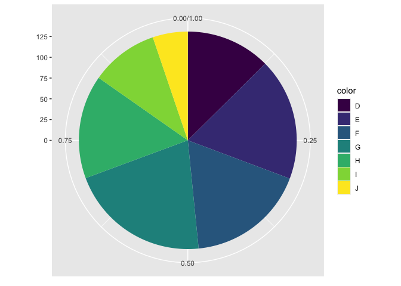
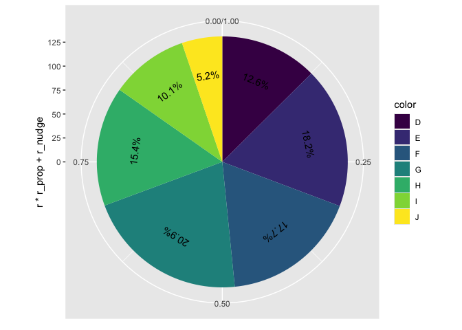
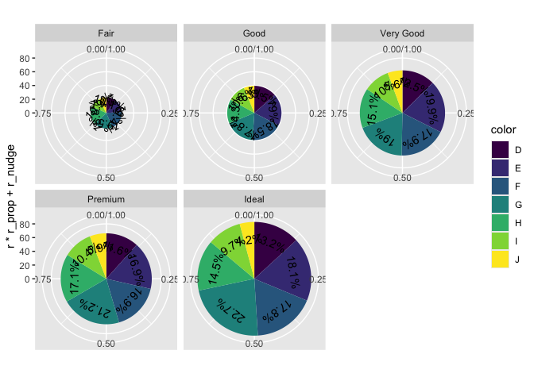
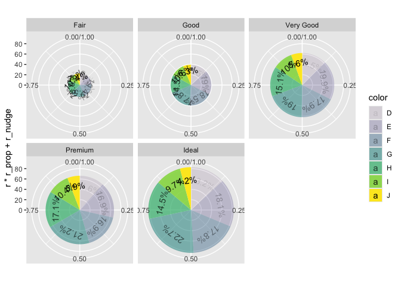
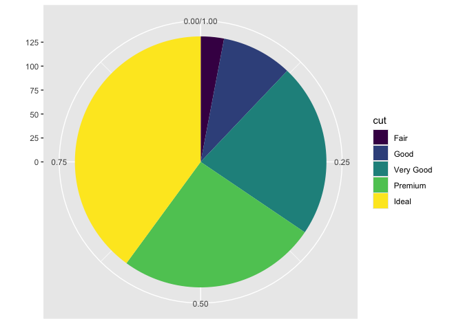
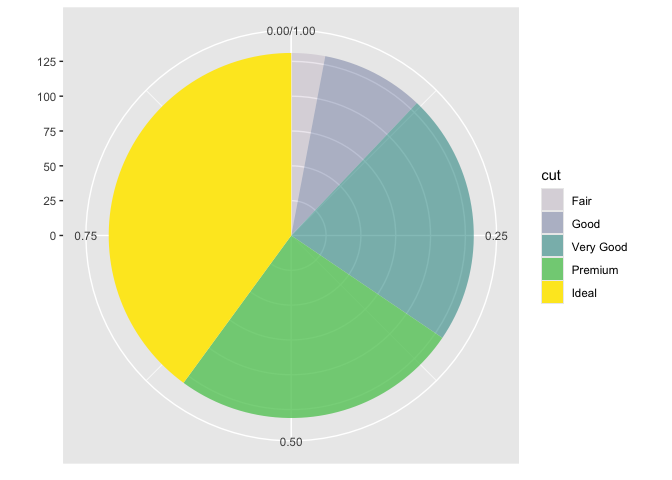
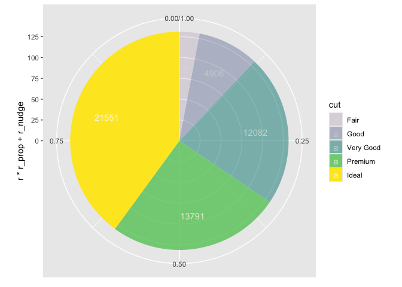
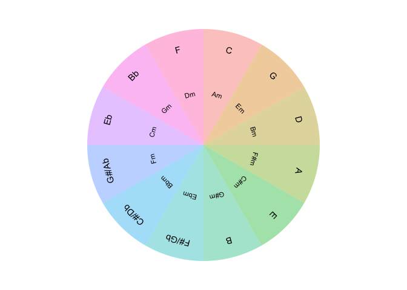
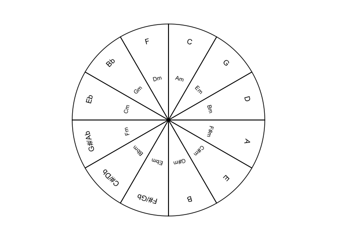

  - [Part 0. Readme as usual](#part-0-readme-as-usual)
  - [Introducing the {ggwedge} package\! 🦄 (typical package write up;
    but actually
    aspirational)](#introducing-the-ggwedge-package--typical-package-write-up-but-actually-aspirational)
      - [Example 🦄 (Aspirational; describes target
        API)](#example--aspirational-describes-target-api)
  - [Part I. Work out functionality ✅](#part-i-work-out-functionality-)
  - [Try it out](#try-it-out)
  - [Part II. Packaging and documentation 🚧
    ✅](#part-ii-packaging-and-documentation--)
      - [Phase 1. Minimal working
        package](#phase-1-minimal-working-package)
          - [Created files for package archetecture with
            `devtools::create(".")`
            ✅](#created-files-for-package-archetecture-with-devtoolscreate-)
          - [Moved functions R folder? ✅](#moved-functions-r-folder-)
          - [Added roxygen skeleton? ✅](#added-roxygen-skeleton-)
          - [Managed dependencies ? ✅](#managed-dependencies--)
          - [Chosen a license? ✅](#chosen-a-license-)
          - [Run `devtools::check()` and addressed errors?
            ✅](#run-devtoolscheck-and-addressed-errors-)
          - [Build package 🚧](#build-package-)
          - [Make aspirational part of readme real.
            🚧](#make-aspirational-part-of-readme-real-)
          - [Add lifecycle badge
            (experimental)](#add-lifecycle-badge-experimental)
      - [Phase 2: Listen & iterate 🚧](#phase-2-listen--iterate-)
      - [Phase 3: Let things settle](#phase-3-let-things-settle)
          - [Settle on examples. Put them in the roxygen skeleton and
            readme.
            🚧](#settle-on-examples-put-them-in-the-roxygen-skeleton-and-readme-)
          - [Written formal tests of functions?
            🚧](#written-formal-tests-of-functions-)
          - [Have you worked added a description and author information
            in the DESCRIPTION file?
            🚧](#have-you-worked-added-a-description-and-author-information-in-the-description-file-)
          - [Addressed *all* notes, warnings and errors.
            🚧](#addressed-all-notes-warnings-and-errors-)
      - [Promote to wider audience…](#promote-to-wider-audience)
          - [Package website built? 🚧](#package-website-built-)
          - [Package website deployed? 🚧](#package-website-deployed-)
      - [Phase 3: Harden/commit](#phase-3-hardencommit)
          - [Submit to CRAN? Or don’t. 🚧](#submit-to-cran-or-dont-)
  - [Appendix: Reports, Environment](#appendix-reports-environment)
      - [Description file extract](#description-file-extract)
      - [Environment](#environment)
      - [`devtools::check()` report](#devtoolscheck-report)

<!-- README.md is generated from README.Rmd. Please edit that file -->

# Part 0. Readme as usual

# Introducing the {ggwedge} package\! 🦄 (typical package write up; but actually aspirational)

<!-- badges: start -->

[](https://lifecycle.r-lib.org/articles/stages.html#experimental)
<!-- badges: end -->

The goal of {ggwedge} is to build those pie charts without the hastle.

To install the dev version use the following:

    remotes::install_github("owner/repo") # 

## Example 🦄 (Aspirational; describes target API)

Try in an interactive session: 🦄 🦄 🦄

``` r
library(ggplot2)
library(ggwedge)
ggplot(diamonds) + 
  aes(fill = cut) + 
  geom_wedge() # for use with cartesian coords

last_plot() + 
  plot_wedge()

ggplot(diamonds) + 
  aes(fill = cut) + 
  geom_pie() + # more true to our pie...
  coords_polar()
```

# Part I. Work out functionality ✅

``` r
compute_panel_pie <- function(data, scales, digits = 1, r_nudge = 0, r_prop = 1){
  
  if(!("weight" %in% names(data))){data$weight <- 1}
  # order matters... Need to add text aesthetics
  # get aes names as they appear in the data
  data_mapped_aes_names <- names(data)[names(data) %in% 
                                         c("fill", "alpha", 
                                             "colour", "group", "linewidth", 
                                             "linetype")]
  
  if(is.null(data$area)){data$area <- 1}
  
  data %>% 
    group_by(across(data_mapped_aes_names)) ->
  data
  
out <- data %>% 
  summarize(count = sum(weight), .groups = 'drop') %>% 
  ungroup() %>% 
  mutate(group = 1:n()) %>% 
  mutate(cum_n = cumsum(.data$count)) %>% 
  mutate(xmax = .data$cum_n/sum(.data$count)) %>% 
  mutate(xmin = lag(.data$xmax)) %>% 
  mutate(xmin = replace_na(.data$xmin, 0)) %>% 
  mutate(r = sqrt(sum(.data$count)/pi)) %>% 
  mutate(r0 = 0) %>% 
  mutate(ymin = 0, 
         ymax = .data$r) %>% 
  mutate(y = 0) # always see zero, donuts.


  if("r" %in% names(data)){out$ymax <- data$r[1]}
  if("r" %in% names(data)){out$r <- data$r[1]}
  if("r0" %in% names(data)){out$ymin <- data$r0[1]}
  # idea that didn't work and I don't know why
  # since rect doesn't use x and y (but xmin xmax etc) this is not as interesting
  # but it seems like a nice unified strategy for supercharging compute functions to do
  # some nice labeling comput for us...  But, not working! Why?
  # if(is_label){out$y <- out$y_text}   

# routine for labels; we do this after r's overridden because y is computed based on this...
out <- out %>% 
  mutate(prop = .data$count/sum(.data$count)) %>% 
  mutate(percent = paste0(round(100*.data$prop, digits), "%")) %>% 
  mutate(r_prop = r_prop) %>% 
  mutate(r_nudge = r_nudge) %>% 
  mutate(x = (.data$xmin + .data$xmax)/2) %>% 
  mutate(y_text = .data$r*.data$r_prop + .data$r_nudge) %>% 
  mutate(angle_wedge =  90 -x*360)

  out
  
}


# compute_panel_pietext <- function(...){
#   
#   compute_panel_pie(..., is_label = T) # overwriting y
#   
#   
# }
```

``` r
library(tidyverse)
#> ── Attaching core tidyverse packages ──────────────────────── tidyverse 2.0.0 ──
#> ✔ dplyr     1.1.4     ✔ readr     2.1.5
#> ✔ forcats   1.0.0     ✔ stringr   1.5.1
#> ✔ ggplot2   3.5.1     ✔ tibble    3.2.1
#> ✔ lubridate 1.9.3     ✔ tidyr     1.3.1
#> ✔ purrr     1.0.2     
#> ── Conflicts ────────────────────────────────────────── tidyverse_conflicts() ──
#> ✖ dplyr::filter() masks stats::filter()
#> ✖ dplyr::lag()    masks stats::lag()
#> ℹ Use the conflicted package (<http://conflicted.r-lib.org/>) to force all conflicts to become errors
ggplot2::diamonds |> 
  mutate(fill = cut) |> 
  mutate(r = 1) |> 
  mutate(r0 = .5) |> 
  compute_panel_pie(r_nudge = 2)
#> Warning: Unknown or uninitialised column: `area`.
#> Warning: There was 1 warning in `group_by()`.
#> ℹ In argument: `across(data_mapped_aes_names)`.
#> Caused by warning:
#> ! Using an external vector in selections was deprecated in tidyselect 1.1.0.
#> ℹ Please use `all_of()` or `any_of()` instead.
#>   # Was:
#>   data %>% select(data_mapped_aes_names)
#> 
#>   # Now:
#>   data %>% select(all_of(data_mapped_aes_names))
#> 
#> See <https://tidyselect.r-lib.org/reference/faq-external-vector.html>.
#> # A tibble: 5 × 18
#>   fill      count group cum_n   xmax   xmin     r    r0  ymin  ymax     y   prop
#>   <ord>     <dbl> <int> <dbl>  <dbl>  <dbl> <dbl> <dbl> <dbl> <dbl> <dbl>  <dbl>
#> 1 Fair       1610     1  1610 0.0298 0          1     0   0.5     1     0 0.0298
#> 2 Good       4906     2  6516 0.121  0.0298     1     0   0.5     1     0 0.0910
#> 3 Very Good 12082     3 18598 0.345  0.121      1     0   0.5     1     0 0.224 
#> 4 Premium   13791     4 32389 0.600  0.345      1     0   0.5     1     0 0.256 
#> 5 Ideal     21551     5 53940 1      0.600      1     0   0.5     1     0 0.400 
#> # ℹ 6 more variables: percent <chr>, r_prop <dbl>, r_nudge <dbl>, x <dbl>,
#> #   y_text <dbl>, angle_wedge <dbl>
```

``` r
StatPie <- ggplot2::ggproto(`_class` = "StatPie",
                  `_inherit` = ggplot2::Stat,
                  compute_panel = compute_panel_pie,
                  default_aes = ggplot2::aes(
                    group = ggplot2::after_stat(group))#,
                    # label = ggplot2::after_stat(percent),
                    # y = ggplot2::after_stat(r*r_prop + r_nudge))
                  )

StatPietext <- ggplot2::ggproto(`_class` = "StatPietext",
                  `_inherit` = ggplot2::Stat,
                  compute_panel = compute_panel_pie,
                  default_aes = ggplot2::aes(
                    group = ggplot2::after_stat(group),
                    label = ggplot2::after_stat(percent),
                    y = ggplot2::after_stat(r*r_prop + r_nudge))
                  )


geom_pie <- function(
  mapping = NULL,
  data = NULL,
  position = "identity",
  na.rm = FALSE,
  show.legend = NA,
  inherit.aes = TRUE, ...) {
  ggplot2::layer(
    stat = StatPie,  # proto object from step 2
    geom = ggplot2::GeomRect,  # inherit other behavior
    data = data,
    mapping = mapping,
    position = position,
    show.legend = show.legend,
    inherit.aes = inherit.aes,
    params = list(na.rm = na.rm, ...)
  )
}

geom_pie_label <- function(
  mapping = NULL,
  data = NULL,
  position = "identity",
  na.rm = FALSE,
  show.legend = NA,
  inherit.aes = TRUE, ...) {
  ggplot2::layer(
    stat = StatPietext,  # proto object from step 2
    geom = ggplot2::GeomText,  # inherit other behavior
    data = data,
    mapping = mapping,
    position = position,
    show.legend = show.legend,
    inherit.aes = inherit.aes,
    params = list(na.rm = na.rm, ...)
  )
}
```

``` r
Titanic %>% 
  data.frame() %>% 
  uncount(weights = Freq) ->
titanic

titanic %>% 
  ggplot() + 
  geom_pie() + 
  coord_polar() + # pie1
  aes(fill = Survived) + # pie2
  scale_fill_manual(values = c("darkgrey", "cadetblue")) + # custom colors
  facet_wrap(facets = vars(Sex)) + #pie3 
  theme_void() + # little clean up
  aes(r = 1) + #pie4
  aes(r0 = .6) + #pie5
  geom_pie_label(r_nudge = .2) + #pie6
  facet_grid(rows = vars(Sex), cols = vars(Class)) + #pie7
  aes(label = after_stat(count)) + #pie8 + 
  aes(label = after_stat(percent)) # bonuspie, back to percentages
```

<!-- -->

``` r

last_plot() +
  facet_grid(rows = vars(Age, Sex), cols = vars(Class)) 
```

<!-- -->

``` r


titanic %>% 
  tidypivot::pivot_helper(rows = Age, cols = Class)
#> # A tibble: 2 × 5
#>   Age   `1st` `2nd` `3rd`  Crew
#>   <fct> <dbl> <dbl> <dbl> <dbl>
#> 1 Child     6    24    79     0
#> 2 Adult   319   261   627   885
```

# Try it out

``` r
ggplot2::diamonds %>% 
  ggplot() + 
  aes(fill = color) + 
  geom_pie() + 
  coord_polar() 
```

<!-- -->

``` r

ggplot2::diamonds %>% 
  ggplot() + 
  aes(fill = color) + 
  geom_pie() + 
  geom_pie_label(r_prop = .7) +
  aes(angle = after_stat(angle_wedge)) +
  coord_polar() +
  NULL
```

<!-- -->

``` r

last_plot() + 
  aes(angle = after_stat(angle_wedge - 90))
```

<!-- -->

``` r

last_plot() + 
  facet_wrap(~cut)
```

<!-- -->

``` r

last_plot() + 
  aes(alpha = color)
```

<!-- -->

``` r

last_plot() + 
  aes(alpha = NULL) + 
  aes(r = 1)
```

<!-- -->

``` r

ggplot2::diamonds %>% 
  count(cut) %>% 
  ggplot() + 
  aes(fill = cut, weight = n) + 
  geom_pie() +
  coord_polar()
```

<!-- -->

``` r

last_plot() +
  aes(alpha = cut)
```

<!-- -->

``` r

last_plot() + 
  geom_pie_label(aes(label = after_stat(count), 
                     angle = after_stat(c(85,0,0,0,0))),
                r_prop = .7, 
                color = "oldlace")
```

<!-- -->

``` r
major = c("C", "G", "D", "A", "E", "B",
            "F#/Gb","C#/Db", "G#/Ab", "Eb", "Bb", "F")
minor = c("Am", "Em", "Bm", "F#m", "C#m", "G#m", "Ebm",
            "Bbm", "Fm", "Cm", "Gm", "Dm")

major_roman = c("I", "V", "II", "VI", "III", "VII", rep("",6))

major %>% 
  tibble(minor) %>% 
  ggplot() + 
  aes(fill = major) + 
  geom_pie(show.legend = F, alpha = .4) + 
  coord_polar() + 
  geom_pie_label(aes(label = after_stat(major)),
                 r_prop = .85) +
  aes(angle = after_stat(angle_wedge - 90)) + 
  geom_pie_label(aes(label = after_stat(minor)),
                 r_prop = .45, size = 3) +
  theme_void() 
```

<!-- -->

``` r

ggwipe::last_plot_wipe(index = 1) + 
  geom_pie(show.legend = F, 
           color = "black", 
           alpha = 0)
```

<!-- -->

# Part II. Packaging and documentation 🚧 ✅

## Phase 1. Minimal working package

### Created files for package archetecture with `devtools::create(".")` ✅

### Moved functions R folder? ✅

``` r
knitr::knit_code$get() |> names()
#>  [1] "unnamed-chunk-1"           "unnamed-chunk-2"          
#>  [3] "compute_panel_pie"         "unnamed-chunk-3"          
#>  [5] "geom_pie"                  "unnamed-chunk-4"          
#>  [7] "unnamed-chunk-5"           "unnamed-chunk-6"          
#>  [9] "unnamed-chunk-7"           "unnamed-chunk-8"          
#> [11] "unnamed-chunk-9"           "unnamed-chunk-10"         
#> [13] "unnamed-chunk-11"          "unnamed-chunk-12"         
#> [15] "unnamed-chunk-13"          "test_calc_frequency_works"
#> [17] "unnamed-chunk-14"          "unnamed-chunk-15"         
#> [19] "unnamed-chunk-16"          "unnamed-chunk-17"
```

Use new {readme2pkg} function to do this from readme…

``` r
knitrExtra:::chunk_to_r("geom_pie")
#> It seems you are currently knitting a Rmd/Qmd file. The parsing of the file will be done in a new R session.
knitrExtra:::chunk_to_r("compute_panel_pie")
#> It seems you are currently knitting a Rmd/Qmd file. The parsing of the file will be done in a new R session.
```

### Added roxygen skeleton? ✅

Use a roxygen skeleton for auto documentation and making sure proposed
functions are *exported*.

### Managed dependencies ? ✅

Package dependencies managed, i.e. `depend::function()` in proposed
functions and declared in the DESCRIPTION

``` r
usethis::use_package("ggplot2")
#> ✔ Setting active project to '/Users/evangelinereynolds/Google
#> Drive/r_packages/ggwedge'
```

### Chosen a license? ✅

``` r
usethis::use_mit_license()
#> ✔ Leaving 'LICENSE' unchanged
#> ✔ Leaving 'LICENSE.md' unchanged
```

### Run `devtools::check()` and addressed errors? ✅

``` r
devtools::check(pkg = ".")
#> ℹ Installed roxygen2 version (7.3.1) doesn't match required (7.2.3)
#> ✖ `check()` will not re-document this package
```

### Build package 🚧

``` r
devtools::build()
#> ── R CMD build ─────────────────────────────────────────────────────────────────
#> * checking for file ‘/Users/evangelinereynolds/Google Drive/r_packages/ggwedge/DESCRIPTION’ ... OK
#> * preparing ‘ggwedge’:
#> * checking DESCRIPTION meta-information ... OK
#> * checking for LF line-endings in source and make files and shell scripts
#> * checking for empty or unneeded directories
#> Removed empty directory ‘ggwedge/man’
#> * building ‘ggwedge_0.0.0.9000.tar.gz’
#> [1] "/Users/evangelinereynolds/Google Drive/r_packages/ggwedge_0.0.0.9000.tar.gz"
```

You need to do this before Part 0 in this document will work.

### Make aspirational part of readme real. 🚧

At this point, you could change eval chunk options to TRUE. You can
remove the 🦄 emoji and perhaps replace it with construction site if you
are still uncertain of the API, and want to highlight that it is subject
to change.

### Add lifecycle badge (experimental)

``` r
usethis::use_lifecycle_badge("experimental")
```

## Phase 2: Listen & iterate 🚧

Try to get feedback from experts on API, implementation, default
decisions. Is there already work that solves this problem?

## Phase 3: Let things settle

### Settle on examples. Put them in the roxygen skeleton and readme. 🚧

### Written formal tests of functions? 🚧

That would look like this…

``` r
library(testthat)
#> 
#> Attaching package: 'testthat'
#> The following object is masked from 'package:dplyr':
#> 
#>     matches
#> The following object is masked from 'package:purrr':
#> 
#>     is_null
#> The following objects are masked from 'package:readr':
#> 
#>     edition_get, local_edition
#> The following object is masked from 'package:tidyr':
#> 
#>     matches

test_that("calc frequency works", {
  expect_equal(440, 440)
  expect_equal(220*1, 220)
  
})
#> Test passed 🥳
```

``` r
readme2pkg::chunk_to_tests_testthat("test_calc_frequency_works")
```

### Have you worked added a description and author information in the DESCRIPTION file? 🚧

### Addressed *all* notes, warnings and errors. 🚧

## Promote to wider audience…

### Package website built? 🚧

### Package website deployed? 🚧

## Phase 3: Harden/commit

### Submit to CRAN? Or don’t. 🚧

# Appendix: Reports, Environment

## Description file extract

## Environment

Here I just want to print the packages and the versions

``` r
all <- sessionInfo() |> print() |> capture.output()
all[11:17]
#> [1] ""                                                                         
#> [2] "time zone: America/Denver"                                                
#> [3] "tzcode source: internal"                                                  
#> [4] ""                                                                         
#> [5] "attached base packages:"                                                  
#> [6] "[1] stats     graphics  grDevices utils     datasets  methods   base     "
#> [7] ""
```

## `devtools::check()` report

``` r
devtools::check(pkg = ".")
#> ℹ Installed roxygen2 version (7.3.1) doesn't match required (7.2.3)
#> ✖ `check()` will not re-document this package
```
