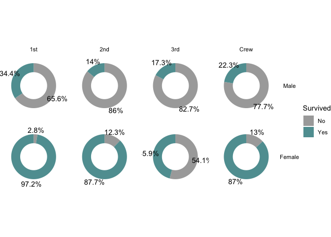
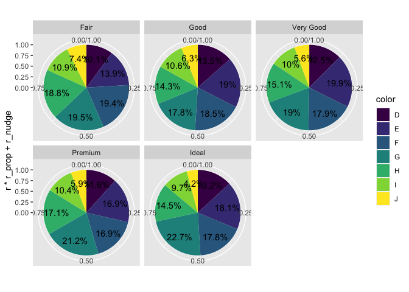

  - [Part 0. Readme as usual](#part-0-readme-as-usual)
  - [Introducing the {ggwedge} package\! 🦄 (typical package write up;
    but actually
    aspirational)](#introducing-the-ggwedge-package--typical-package-write-up-but-actually-aspirational)
      - [Example 🦄 (Aspirational; describes target
        API)](#example--aspirational-describes-target-api)
  - [Part I. Work out functionality ✅](#part-i-work-out-functionality-)
  - [Try it out](#try-it-out)
  - [Part II. Packaging and documentation 🚧
    ✅](#part-ii-packaging-and-documentation--)
      - [Phase 1. Minimal working
        package](#phase-1-minimal-working-package)
          - [Created files for package archetecture with
            `devtools::create(".")`
            ✅](#created-files-for-package-archetecture-with-devtoolscreate-)
          - [Moved functions R folder? ✅](#moved-functions-r-folder-)
          - [Added roxygen skeleton? ✅](#added-roxygen-skeleton-)
          - [Managed dependencies ? ✅](#managed-dependencies--)
          - [Chosen a license? ✅](#chosen-a-license-)
          - [Run `devtools::check()` and addressed errors?
            ✅](#run-devtoolscheck-and-addressed-errors-)
          - [Build package 🚧](#build-package-)
          - [Make aspirational part of readme real.
            🚧](#make-aspirational-part-of-readme-real-)
          - [Add lifecycle badge
            (experimental)](#add-lifecycle-badge-experimental)
      - [Phase 2: Listen & iterate 🚧](#phase-2-listen--iterate-)
      - [Phase 3: Let things settle](#phase-3-let-things-settle)
          - [Settle on examples. Put them in the roxygen skeleton and
            readme.
            🚧](#settle-on-examples-put-them-in-the-roxygen-skeleton-and-readme-)
          - [Written formal tests of functions?
            🚧](#written-formal-tests-of-functions-)
          - [Have you worked added a description and author information
            in the DESCRIPTION file?
            🚧](#have-you-worked-added-a-description-and-author-information-in-the-description-file-)
          - [Addressed *all* notes, warnings and errors.
            🚧](#addressed-all-notes-warnings-and-errors-)
      - [Promote to wider audience…](#promote-to-wider-audience)
          - [Package website built? 🚧](#package-website-built-)
          - [Package website deployed? 🚧](#package-website-deployed-)
      - [Phase 3: Harden/commit](#phase-3-hardencommit)
          - [Submit to CRAN? Or don’t. 🚧](#submit-to-cran-or-dont-)
  - [Appendix: Reports, Environment](#appendix-reports-environment)
      - [Description file extract](#description-file-extract)
      - [Environment](#environment)
      - [`devtools::check()` report](#devtoolscheck-report)

<!-- README.md is generated from README.Rmd. Please edit that file -->

# Part 0. Readme as usual

# Introducing the {ggwedge} package\! 🦄 (typical package write up; but actually aspirational)

<!-- badges: start -->

[](https://lifecycle.r-lib.org/articles/stages.html#experimental)
<!-- badges: end -->

The goal of {ggwedge} is to build those pie charts without the hastle.

To install the dev version use the following:

    remotes::install_github("owner/repo") # 

## Example 🦄 (Aspirational; describes target API)

Try in an interactive session: 🦄 🦄 🦄

``` r
library(ggplot2)
library(ggwedge)
ggplot(diamonds) + 
  aes(fill = cut) + 
  geom_wedge() # for use with cartesian coords

last_plot() + 
  plot_wedge()

ggplot(diamonds) + 
  aes(fill = cut) + 
  geom_pie() + # more true to our pie...
  coords_polar()
```

# Part I. Work out functionality ✅

``` r
compute_panel_pie <- function(data, scales, digits = 1, r_nudge = 0, r_prop = 1){
  
  if(!("weight" %in% names(data))){data$weight <- 1}
  # order matters... Need to add text aesthetics
  if("fill" %in% names(data)){data <- group_by(data, fill, .add = T)}
  if("alpha" %in% names(data)){data <- group_by(data, alpha, .add = T)}
  if("colour" %in% names(data)){data <- group_by(data, colour, .add = T)}
  if("group" %in% names(data)){data <- group_by(data, group, .add = T)}
  if("linetype" %in% names(data)){data <- group_by(data, linetype, .add = T)}
  if("linewidth" %in% names(data)){data <- group_by(data, linewidth, .add = T)}
  
out <- data %>% 
  summarize(wt = sum(weight)) %>% 
  ungroup() %>% 
  mutate(group = 1:n()) %>% 
  mutate(cum_n = cumsum(.data$wt)) %>% 
  mutate(xmax = .data$cum_n/sum(.data$wt)) %>% 
  mutate(xmin = lag(.data$xmax)) %>% 
  mutate(xmin = replace_na(.data$xmin, 0)) %>% 
  mutate(r = sqrt(sum(.data$wt)/pi)) %>% 
  mutate(r0 = 0) %>% 
  mutate(ymin = 0, ymax = .data$r) 

  if("r" %in% names(data)){out$ymax <- data$r[1]}
  if("r0" %in% names(data)){out$ymin <- data$r0[1]}
  # idea that didn't work and I don't know why
  # since rect doesn't use x and y (but xmin xmax etc) this is not as interesting
  # but it seems like a nice unified strategy for supercharging compute functions to do
  # some nice labeling comput for us...  But, not working! Why?
  # if(is_label){out$y <- out$y_text}   

# routine for labels; we do this after r's overridden because y is computed based on this...
out <- out %>% 
  mutate(prop = .data$wt/sum(.data$wt)) %>% 
  mutate(percent = paste0(round(100*.data$prop, digits), "%")) %>% 
  mutate(r_prop = r_prop) %>% 
  mutate(r_nudge = r_nudge) %>% 
  mutate(x = (.data$xmin + .data$xmax)/2) %>% 
  mutate(y = .data$r*.data$r_prop + .data$r_nudge)

  out
  
}


# compute_panel_pietext <- function(...){
#   
#   compute_panel_pie(..., is_label = T) # overwriting y
#   
#   
# }
```

``` r
library(tidyverse)
#> ── Attaching core tidyverse packages ─────────────────── tidyverse 2.0.0.9000 ──
#> ✔ dplyr     1.1.0     ✔ readr     2.1.4
#> ✔ forcats   1.0.0     ✔ stringr   1.5.0
#> ✔ ggplot2   3.4.4     ✔ tibble    3.2.1
#> ✔ lubridate 1.9.2     ✔ tidyr     1.3.0
#> ✔ purrr     1.0.1     
#> ── Conflicts ────────────────────────────────────────── tidyverse_conflicts() ──
#> ✖ dplyr::filter() masks stats::filter()
#> ✖ dplyr::lag()    masks stats::lag()
#> ℹ Use the conflicted package (<http://conflicted.r-lib.org/>) to force all conflicts to become errors
ggplot2::diamonds |> 
  mutate(fill = cut) |> 
  mutate(r = 1) |> 
  mutate(r0 = .5) |> 
  compute_panel_pie(r_nudge = 2)
#> # A tibble: 5 × 16
#>   fill       wt group cum_n   xmax   xmin     r    r0  ymin  ymax   prop percent
#>   <ord>   <dbl> <int> <dbl>  <dbl>  <dbl> <dbl> <dbl> <dbl> <dbl>  <dbl> <chr>  
#> 1 Fair     1610     1  1610 0.0298 0       131.     0   0.5     1 0.0298 3%     
#> 2 Good     4906     2  6516 0.121  0.0298  131.     0   0.5     1 0.0910 9.1%   
#> 3 Very G… 12082     3 18598 0.345  0.121   131.     0   0.5     1 0.224  22.4%  
#> 4 Premium 13791     4 32389 0.600  0.345   131.     0   0.5     1 0.256  25.6%  
#> 5 Ideal   21551     5 53940 1      0.600   131.     0   0.5     1 0.400  40%    
#> # ℹ 4 more variables: r_prop <dbl>, r_nudge <dbl>, x <dbl>, y <dbl>
```

``` r
StatPie <- ggplot2::ggproto(`_class` = "StatPie",
                  `_inherit` = ggplot2::Stat,
                  compute_panel = compute_panel_pie,
                  default_aes = ggplot2::aes(
                    group = ggplot2::after_stat(group),
                    label = ggplot2::after_stat(percent),
                    y = ggplot2::after_stat(r*r_prop + r_nudge))
                  )

geom_pie <- function(
  mapping = NULL,
  data = NULL,
  position = "identity",
  na.rm = FALSE,
  show.legend = NA,
  inherit.aes = TRUE, ...) {
  ggplot2::layer(
    stat = StatPie,  # proto object from step 2
    geom = ggplot2::GeomRect,  # inherit other behavior
    data = data,
    mapping = mapping,
    position = position,
    show.legend = show.legend,
    inherit.aes = inherit.aes,
    params = list(na.rm = na.rm, ...)
  )
}

geom_pie_label <- function(
  mapping = NULL,
  data = NULL,
  position = "identity",
  na.rm = FALSE,
  show.legend = NA,
  inherit.aes = TRUE, ...) {
  ggplot2::layer(
    stat = StatPie,  # proto object from step 2
    geom = ggplot2::GeomText,  # inherit other behavior
    data = data,
    mapping = mapping,
    position = position,
    show.legend = show.legend,
    inherit.aes = inherit.aes,
    params = list(na.rm = na.rm, ...)
  )
}
```

# Try it out

``` r
ggplot2::diamonds %>% 
  ggplot() + 
  aes(fill = color) + 
  geom_pie() + 
  coord_polar()
#> `summarise()` has grouped output by 'fill'. You can override using the
#> `.groups` argument.
```

<!-- -->

``` r

layer_data()
#> `summarise()` has grouped output by 'fill'. You can override using the
#> `.groups` argument.
#>        fill       y group label PANEL    wt cum_n      xmax      xmin       r
#> 1 #440154FF 131.033     1 12.6%     1  6775  6775 0.1256025 0.0000000 131.033
#> 2 #443A83FF 131.033     2 18.2%     1  9797 16572 0.3072303 0.1256025 131.033
#> 3 #31688EFF 131.033     3 17.7%     1  9542 26114 0.4841305 0.3072303 131.033
#> 4 #21908CFF 131.033     4 20.9%     1 11292 37406 0.6934742 0.4841305 131.033
#> 5 #35B779FF 131.033     5 15.4%     1  8304 45710 0.8474231 0.6934742 131.033
#> 6 #8FD744FF 131.033     6 10.1%     1  5422 51132 0.9479422 0.8474231 131.033
#> 7 #FDE725FF 131.033     7  5.2%     1  2808 53940 1.0000000 0.9479422 131.033
#>   r0 ymin    ymax       prop percent r_prop r_nudge          x colour linewidth
#> 1  0    0 131.033 0.12560252   12.6%      1       0 0.06280126     NA       0.5
#> 2  0    0 131.033 0.18162773   18.2%      1       0 0.21641639     NA       0.5
#> 3  0    0 131.033 0.17690026   17.7%      1       0 0.39568039     NA       0.5
#> 4  0    0 131.033 0.20934372   20.9%      1       0 0.58880237     NA       0.5
#> 5  0    0 131.033 0.15394883   15.4%      1       0 0.77044865     NA       0.5
#> 6  0    0 131.033 0.10051910   10.1%      1       0 0.89768261     NA       0.5
#> 7  0    0 131.033 0.05205784    5.2%      1       0 0.97397108     NA       0.5
#>   linetype alpha
#> 1        1    NA
#> 2        1    NA
#> 3        1    NA
#> 4        1    NA
#> 5        1    NA
#> 6        1    NA
#> 7        1    NA

ggplot2::diamonds %>% 
  ggplot() + 
  aes(fill = color) + 
  geom_pie() + 
  geom_pie_label(r_nudge = -50) +
  coord_polar() +
  NULL
#> `summarise()` has grouped output by 'fill'. You can override using the
#> `.groups` argument.
#> `summarise()` has grouped output by 'fill'. You can override using the
#> `.groups` argument.
```

<!-- -->

``` r

layer_data()
#> `summarise()` has grouped output by 'fill'. You can override using the
#> `.groups` argument.
#> `summarise()` has grouped output by 'fill'. You can override using the
#> `.groups` argument.
#>        fill       y group label PANEL    wt cum_n      xmax      xmin       r
#> 1 #440154FF 131.033     1 12.6%     1  6775  6775 0.1256025 0.0000000 131.033
#> 2 #443A83FF 131.033     2 18.2%     1  9797 16572 0.3072303 0.1256025 131.033
#> 3 #31688EFF 131.033     3 17.7%     1  9542 26114 0.4841305 0.3072303 131.033
#> 4 #21908CFF 131.033     4 20.9%     1 11292 37406 0.6934742 0.4841305 131.033
#> 5 #35B779FF 131.033     5 15.4%     1  8304 45710 0.8474231 0.6934742 131.033
#> 6 #8FD744FF 131.033     6 10.1%     1  5422 51132 0.9479422 0.8474231 131.033
#> 7 #FDE725FF 131.033     7  5.2%     1  2808 53940 1.0000000 0.9479422 131.033
#>   r0 ymin    ymax       prop percent r_prop r_nudge          x colour linewidth
#> 1  0    0 131.033 0.12560252   12.6%      1       0 0.06280126     NA       0.5
#> 2  0    0 131.033 0.18162773   18.2%      1       0 0.21641639     NA       0.5
#> 3  0    0 131.033 0.17690026   17.7%      1       0 0.39568039     NA       0.5
#> 4  0    0 131.033 0.20934372   20.9%      1       0 0.58880237     NA       0.5
#> 5  0    0 131.033 0.15394883   15.4%      1       0 0.77044865     NA       0.5
#> 6  0    0 131.033 0.10051910   10.1%      1       0 0.89768261     NA       0.5
#> 7  0    0 131.033 0.05205784    5.2%      1       0 0.97397108     NA       0.5
#>   linetype alpha
#> 1        1    NA
#> 2        1    NA
#> 3        1    NA
#> 4        1    NA
#> 5        1    NA
#> 6        1    NA
#> 7        1    NA

last_plot() + 
  aes(alpha = cut)
#> `summarise()` has grouped output by 'fill', 'alpha'. You can override using the
#> `.groups` argument.
#> `summarise()` has grouped output by 'fill', 'alpha'. You can override using the
#> `.groups` argument.
```

<!-- -->

``` r

last_plot() + 
  facet_wrap(~color)
#> `summarise()` has grouped output by 'fill', 'alpha'. You can override using the
#> `.groups` argument.
#> `summarise()` has grouped output by 'fill', 'alpha'. You can override using the
#> `.groups` argument.
#> `summarise()` has grouped output by 'fill', 'alpha'. You can override using the
#> `.groups` argument.
#> `summarise()` has grouped output by 'fill', 'alpha'. You can override using the
#> `.groups` argument.
#> `summarise()` has grouped output by 'fill', 'alpha'. You can override using the
#> `.groups` argument.
#> `summarise()` has grouped output by 'fill', 'alpha'. You can override using the
#> `.groups` argument.
#> `summarise()` has grouped output by 'fill', 'alpha'. You can override using the
#> `.groups` argument.
#> `summarise()` has grouped output by 'fill', 'alpha'. You can override using the
#> `.groups` argument.
#> `summarise()` has grouped output by 'fill', 'alpha'. You can override using the
#> `.groups` argument.
#> `summarise()` has grouped output by 'fill', 'alpha'. You can override using the
#> `.groups` argument.
#> `summarise()` has grouped output by 'fill', 'alpha'. You can override using the
#> `.groups` argument.
#> `summarise()` has grouped output by 'fill', 'alpha'. You can override using the
#> `.groups` argument.
#> `summarise()` has grouped output by 'fill', 'alpha'. You can override using the
#> `.groups` argument.
#> `summarise()` has grouped output by 'fill', 'alpha'. You can override using the
#> `.groups` argument.
```

<!-- -->

``` r

last_plot() +
  facet_wrap(~color) + 
  coord_cartesian()
#> Coordinate system already present. Adding new coordinate system, which will
#> replace the existing one.
#> `summarise()` has grouped output by 'fill', 'alpha'. You can override using the `.groups` argument.
#> `summarise()` has grouped output by 'fill', 'alpha'. You can override using the `.groups` argument.
#> `summarise()` has grouped output by 'fill', 'alpha'. You can override using the `.groups` argument.
#> `summarise()` has grouped output by 'fill', 'alpha'. You can override using the `.groups` argument.
#> `summarise()` has grouped output by 'fill', 'alpha'. You can override using the `.groups` argument.
#> `summarise()` has grouped output by 'fill', 'alpha'. You can override using the `.groups` argument.
#> `summarise()` has grouped output by 'fill', 'alpha'. You can override using the `.groups` argument.
#> `summarise()` has grouped output by 'fill', 'alpha'. You can override using the `.groups` argument.
#> `summarise()` has grouped output by 'fill', 'alpha'. You can override using the `.groups` argument.
#> `summarise()` has grouped output by 'fill', 'alpha'. You can override using the `.groups` argument.
#> `summarise()` has grouped output by 'fill', 'alpha'. You can override using the `.groups` argument.
#> `summarise()` has grouped output by 'fill', 'alpha'. You can override using the `.groups` argument.
#> `summarise()` has grouped output by 'fill', 'alpha'. You can override using the `.groups` argument.
#> `summarise()` has grouped output by 'fill', 'alpha'. You can override using the `.groups` argument.
```

<!-- -->

``` r

last_plot() + 
  coord_polar()
#> Coordinate system already present. Adding new coordinate system, which will
#> replace the existing one.
#> `summarise()` has grouped output by 'fill', 'alpha'. You can override using the `.groups` argument.
#> `summarise()` has grouped output by 'fill', 'alpha'. You can override using the `.groups` argument.
#> `summarise()` has grouped output by 'fill', 'alpha'. You can override using the `.groups` argument.
#> `summarise()` has grouped output by 'fill', 'alpha'. You can override using the `.groups` argument.
#> `summarise()` has grouped output by 'fill', 'alpha'. You can override using the `.groups` argument.
#> `summarise()` has grouped output by 'fill', 'alpha'. You can override using the `.groups` argument.
#> `summarise()` has grouped output by 'fill', 'alpha'. You can override using the `.groups` argument.
#> `summarise()` has grouped output by 'fill', 'alpha'. You can override using the `.groups` argument.
#> `summarise()` has grouped output by 'fill', 'alpha'. You can override using the `.groups` argument.
#> `summarise()` has grouped output by 'fill', 'alpha'. You can override using the `.groups` argument.
#> `summarise()` has grouped output by 'fill', 'alpha'. You can override using the `.groups` argument.
#> `summarise()` has grouped output by 'fill', 'alpha'. You can override using the `.groups` argument.
#> `summarise()` has grouped output by 'fill', 'alpha'. You can override using the `.groups` argument.
#> `summarise()` has grouped output by 'fill', 'alpha'. You can override using the `.groups` argument.
```

<!-- -->

``` r

last_plot() + 
  aes(r = 1, r0 = .5)
#> `summarise()` has grouped output by 'fill', 'alpha'. You can override using the
#> `.groups` argument.
#> `summarise()` has grouped output by 'fill', 'alpha'. You can override using the
#> `.groups` argument.
#> `summarise()` has grouped output by 'fill', 'alpha'. You can override using the
#> `.groups` argument.
#> `summarise()` has grouped output by 'fill', 'alpha'. You can override using the
#> `.groups` argument.
#> `summarise()` has grouped output by 'fill', 'alpha'. You can override using the
#> `.groups` argument.
#> `summarise()` has grouped output by 'fill', 'alpha'. You can override using the
#> `.groups` argument.
#> `summarise()` has grouped output by 'fill', 'alpha'. You can override using the
#> `.groups` argument.
#> `summarise()` has grouped output by 'fill', 'alpha'. You can override using the
#> `.groups` argument.
#> `summarise()` has grouped output by 'fill', 'alpha'. You can override using the
#> `.groups` argument.
#> `summarise()` has grouped output by 'fill', 'alpha'. You can override using the
#> `.groups` argument.
#> `summarise()` has grouped output by 'fill', 'alpha'. You can override using the
#> `.groups` argument.
#> `summarise()` has grouped output by 'fill', 'alpha'. You can override using the
#> `.groups` argument.
#> `summarise()` has grouped output by 'fill', 'alpha'. You can override using the
#> `.groups` argument.
#> `summarise()` has grouped output by 'fill', 'alpha'. You can override using the
#> `.groups` argument.
```

<!-- -->

``` r

ggplot2::diamonds %>% 
  count(cut) %>% 
  ggplot() + 
  aes(fill = cut, weight = n) + 
  geom_pie() +
  coord_polar()
#> `summarise()` has grouped output by 'fill'. You can override using the
#> `.groups` argument.
```

<!-- -->

``` r

last_plot() + 
  geom_pie_label(aes(label = after_stat(wt), angle = after_stat(c(85,0,0,0,0))),
                 r_prop = .7, 
                 color = "oldlace")
#> `summarise()` has grouped output by 'fill'. You can override using the
#> `.groups` argument.
#> `summarise()` has grouped output by 'fill'. You can override using the
#> `.groups` argument.
```

<!-- -->

# Part II. Packaging and documentation 🚧 ✅

## Phase 1. Minimal working package

### Created files for package archetecture with `devtools::create(".")` ✅

### Moved functions R folder? ✅

``` r
knitr::knit_code$get() |> names()
#>  [1] "unnamed-chunk-1"           "unnamed-chunk-2"          
#>  [3] "compute_panel_pie"         "unnamed-chunk-3"          
#>  [5] "geom_pie"                  "unnamed-chunk-4"          
#>  [7] "unnamed-chunk-5"           "unnamed-chunk-6"          
#>  [9] "unnamed-chunk-7"           "unnamed-chunk-8"          
#> [11] "unnamed-chunk-9"           "unnamed-chunk-10"         
#> [13] "unnamed-chunk-11"          "test_calc_frequency_works"
#> [15] "unnamed-chunk-12"          "unnamed-chunk-13"         
#> [17] "unnamed-chunk-14"          "unnamed-chunk-15"
```

Use new {readme2pkg} function to do this from readme…

``` r
readme2pkg::chunk_to_r("geom_pie")
readme2pkg::chunk_to_r("compute_panel_pie")
```

### Added roxygen skeleton? ✅

Use a roxygen skeleton for auto documentation and making sure proposed
functions are *exported*.

### Managed dependencies ? ✅

Package dependencies managed, i.e. `depend::function()` in proposed
functions and declared in the DESCRIPTION

``` r
usethis::use_package("ggplot2")
#> ✔ Setting active project to '/Users/evangelinereynolds/Google Drive/r_packages/ggwedge'
#> • Refer to functions with `ggplot2::fun()`
```

### Chosen a license? ✅

``` r
usethis::use_mit_license()
```

### Run `devtools::check()` and addressed errors? ✅

``` r
devtools::check(pkg = ".")
#> ℹ Updating ggwedge documentation
#> ℹ Loading ggwedge
```

### Build package 🚧

``` r
devtools::build()
#> ── R CMD build ─────────────────────────────────────────────────────────────────
#> * checking for file ‘/Users/evangelinereynolds/Google Drive/r_packages/ggwedge/DESCRIPTION’ ... OK
#> * preparing ‘ggwedge’:
#> * checking DESCRIPTION meta-information ... OK
#> * checking for LF line-endings in source and make files and shell scripts
#> * checking for empty or unneeded directories
#> Removed empty directory ‘ggwedge/man’
#> * building ‘ggwedge_0.0.0.9000.tar.gz’
#> [1] "/Users/evangelinereynolds/Google Drive/r_packages/ggwedge_0.0.0.9000.tar.gz"
```

You need to do this before Part 0 in this document will work.

### Make aspirational part of readme real. 🚧

At this point, you could change eval chunk options to TRUE. You can
remove the 🦄 emoji and perhaps replace it with construction site if you
are still uncertain of the API, and want to highlight that it is subject
to change.

### Add lifecycle badge (experimental)

``` r
usethis::use_lifecycle_badge("experimental")
```

## Phase 2: Listen & iterate 🚧

Try to get feedback from experts on API, implementation, default
decisions. Is there already work that solves this problem?

## Phase 3: Let things settle

### Settle on examples. Put them in the roxygen skeleton and readme. 🚧

### Written formal tests of functions? 🚧

That would look like this…

``` r
library(testthat)
#> 
#> Attaching package: 'testthat'
#> The following object is masked from 'package:dplyr':
#> 
#>     matches
#> The following object is masked from 'package:purrr':
#> 
#>     is_null
#> The following objects are masked from 'package:readr':
#> 
#>     edition_get, local_edition
#> The following object is masked from 'package:tidyr':
#> 
#>     matches

test_that("calc frequency works", {
  expect_equal(440, 440)
  expect_equal(220*1, 220)
  
})
#> Test passed 🎊
```

``` r
readme2pkg::chunk_to_tests_testthat("test_calc_frequency_works")
```

### Have you worked added a description and author information in the DESCRIPTION file? 🚧

### Addressed *all* notes, warnings and errors. 🚧

## Promote to wider audience…

### Package website built? 🚧

### Package website deployed? 🚧

## Phase 3: Harden/commit

### Submit to CRAN? Or don’t. 🚧

# Appendix: Reports, Environment

## Description file extract

## Environment

Here I just want to print the packages and the versions

``` r
all <- sessionInfo() |> print() |> capture.output()
all[11:17]
#> [1] ""                                                                         
#> [2] "attached base packages:"                                                  
#> [3] "[1] stats     graphics  grDevices utils     datasets  methods   base     "
#> [4] ""                                                                         
#> [5] "other attached packages:"                                                 
#> [6] " [1] testthat_3.1.6       ggwedge_0.0.0.9000   lubridate_1.9.2     "      
#> [7] " [4] forcats_1.0.0        stringr_1.5.0        dplyr_1.1.0         "
```

## `devtools::check()` report

``` r
devtools::check(pkg = ".")
#> ℹ Updating ggwedge documentation
#> ℹ Loading ggwedge
```
